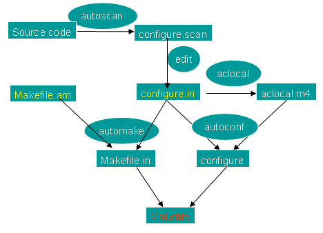

#使用automake/autoconf生成makefile
无论是在Linux还是在Unix环境中，make都是一个非常重要的编译命令。不管是自己进行项目开发还是安装应用软件，我们都经常要用到make或 make install。利用make工具，我们可以将大型的开发项目分解成为多个更易于管理的模块，对于一个包括几百个源文件的应用程序，使用make和 makefile工具就可以轻而易举的理顺各个源文件之间纷繁复杂的相互关系        
但是如果通过查阅make的帮助文档来手工编写Makefile,对任何程序员都是一场挑战。幸而有GNU 提供的Autoconf及Automake这两套工具使得编写makefile不再是一个难题           
本文将介绍如何利用 GNU Autoconf 及 Automake 这两套工具来协助我们自动产生 Makefile文件，并且让开发出来的软件可以像大多数源码包那样，只需"./configure", "make","make install" 就可以把程序安装到系统中          
       
####所需工具
在开始使用automake之前，首先确认你的系统安装如下软件
```text
yum -y install autoconf automake m4 perl libtool
```
autoconf是一个用于生成可以自动地配置软件源码包，用以适应多种UNIX类系统的shell脚本工具，其中autoconf需要用到 m4，便于生成脚本。           
automake是一个从Makefile.am文件自动生成Makefile.in的工具。为了生成Makefile.in，automake还需用到perl，由于automake创建的发布完全遵循GNU标准，所以在创建中不需要perl。libtool是一款方便生成各种程序库的工具        

目前automake支持三种目录层次：flat、shallow和deep       
1.flat指的是所有文件都位于同一个目录中，就是所有源文件、头文件以及其他库文件都位于当前目录中，且没有子目录。Termutils就是这一类        
2.shallow指的是主要的源代码都储存在顶层目录，其他各个部分则储存在子目录中。就是主要源文件在当前目录中，而其它一些实现各部分功能的源文件位于各自不同的目录。automake本身就是这一类。        
3.deep指的是所有源代码都被储存在子目录中；顶层目录主要包含配置信息.就是所有源文件及自己写的头文件位于当前目录的一个子目录中，而当前目录里没有任何源文件。 GNU cpio和GNU tar就是这一类          

flat类型是最简单的，deep类型是最复杂的。不难看出，我们的模拟需求正是基于第三类deep型，也就是说我们要做挑战性的事情：)。注：我们的测试程序是基于多线程的简单程序
####创建configure.in文件
```bash
autoscan
```
执行上面的命令，在当前目录生成`autoscan.log`和`configure.scan`，把`configure.scan`修改为`configure.in`        
```bash
mv configure.scan configure.in
```
```bash
vi configure.in
```
```text
#                                               -*- Autoconf -*-
# Process this file with autoconf to produce a configure script.

AC_PREREQ([2.63])
AC_INIT([FULL-PACKAGE-NAME], [VERSION], [BUG-REPORT-ADDRESS])
AC_CONFIG_SRCDIR([one.c])
AC_CONFIG_HEADERS([config.h])

# Checks for programs.
AC_PROG_CC

# Checks for libraries.

# Checks for header files.

# Checks for typedefs, structures, and compiler characteristics.

# Checks for library functions.

AC_OUTPUT
```
`AC_PREREQ`表示文件要求的autoconf的版本       
`AC_INIT`定义了程序的名称，版本，和错误报告地址，一般情况下BUG-DEPORT-ADDRESS可以省略，用户可以根据自己的需求定制              
`AM_INIT_AUTOMAKE(one, 1.0)`启动automake                
`AC_CONFIG_SRCFIR([hello.c])`检查源文件是否存在       
`AC_CONFIG_HEADERS([config.h])`指定配置头文件，这个由`autoheader`命令生成，产生的头文件必须被`.c`或`.cpp`文件用`#include <config.h>`包含，这些宏才能应用到C编译时                   
`AM_CONFIG_HEADERS([config.h])` 这个宏可以代替上面的宏，但是有时候会提示错误，那么直接删除这个宏        
`AC_CONFIG_FILES(Makefile)`如果没有在AC_OUTPUT宏，指定文件名的话，那么就要使用这个宏指定文件          
`AC_OUTPUT(Makefile)`用来指定生成的文件，一般为Makefile         
修改后的configure.in
```text
#                                               -*- Autoconf -*-
# Process this file with autoconf to produce a configure script.

AC_PREREQ([2.63])
AC_INIT(one, 1.0)
AM_INIT_AUTOMAKE(one, 1.0)
AC_CONFIG_SRCDIR([one.c])

# Checks for programs.
AC_PROG_CC

# Checks for libraries.

# Checks for header files.

# Checks for typedefs, structures, and compiler characteristics.

# Checks for library functions.

AC_OUTPUT(Makefile)
```
####创建Makefile.am文件
```text
AUTOMAKE_OPTIONS=foreign
bin_PROGRAMS=one
one_SOURCES=one.c
```
`AUTOMAKE_OPTIONS`用来设置automake的软件等级，可用选项有forrign，gnu，gnits，foreign表示只检测必要文件           
`bin_PROGRAMS`用来指定生成的可执行文件，多个时，用空格分开        
`one_SOURCES`用来指定生成可执行文件的依赖文件，多个依赖文件用空格分开         

```text
文件类型       书写格式
可执行文件     bin_PROGRAMS=foo
               foo_SOURCES=xxx.c
               foo_LDADD=
               foo_LDFLAGS=
               foo_DEPENDENCIES=
静态库         lib_LIBRARIES=libfoo.a
               foo_a_SOURCES=
               foo_a_LDADD=
               foo_a_LIBADD=
               foo_a_LDFLAGS=
头文件         include_HEADERS=foo.h
数据文件       data_DATA=data1 data2
```
对于可执行文件和静态库类型，如果只想编译，不想安装到系统中，可以用noinstall_PROGRAMS代替bin_PROGRAMS，noinstall_LIBRARIES代替lib_LIBRARIES     
```text
全局变量       含义
INCLUDES       比如链接时所需要的头文件
LDADD          比如链接时所需要的库文件
LDFLAGS         比如链接时所需要的库文件选项标志
EXTRA_DIST      源程序和一些默认的文件将自动打入.tar.gz包可以用这种方法，比如配置文件，数据文件等等
SUBDIRS         在处理本目录之前要递归处理哪些子目录
```
在Makefile.am中尽量使用相对路径，系统预定义了两个基本路径
```text
路径变量        含义
$(top_srcdir)   工程最顶层目录，用于引用源程序
$(top_builddir) 定义了生成目标文件上最上层目录，用于引用.o等编译出来的目标文件
```
automake设置了默认的安装路径         
默认安装路径为`$(prefix)=/usr/local`，可以通过`./configure --prefix=<new_path>`的方法来覆盖        
其他预定义的目录还包括等等
```text
bindir=$(prefix)/bin, libdir=$(prefix)/lib,datadir=$(prefix)/share,sysconfdir=$(prefix)/etc
```
创建一个Makefile.am来指明包含的子目录
```text
SUBDIRS=src/lib src/ModuleA/apple/shell src/ModuleA/apple/core
CURRENTPATH=$(shell /bin/pwd)
INCLUDES=-I$(CURRENTPATH)/src/include -I$(CURRENTPATH)/src/ModuleA/apple/include
export INCLUDES
```
我们将lib目录下的swap.c文件编译成libswap.a文件，被apple/shell/apple.c文件调用，那么lib目录下的Makefile.am如下
```text
noinstall_LIBRARIES=libswap.a
libswap_a_SOURCES=swap.c
INCLUDES=-I$(top_srcdir)/src/include
```
上面是不安装到系统中，如果安装，库将会安装到`$(prefix)/lib`目录下，可执行文件将会安装到`$(prefix)/bin`
```text
bin_LIBRARIES=libswap.a
libswap_a_SOURCES=swap.c
INCLUDES=-I$(top_srcdir)/src/include
swapincludedir=$(includedir)/swap
swapinclude_HEADERS=$(top_srcdir)/src/include/swap.h
```
最后两行的意思是将swap.h安装到`$(prefix)/include/swap`目录下

可执行文件
```text
noinstall_PROGRAMS=test
test_SOURCES=test.c
test_LDADD=$(top_srcdir)/src/ModuleA/apple/shell/apple.o $(top_srcdir)/src/lib/libswap.a
test_LDFLAGS=-D_GNU_SOURCE
DEFS+=-D_GNU_SOURCE
#LIBS=-lpthread
```

