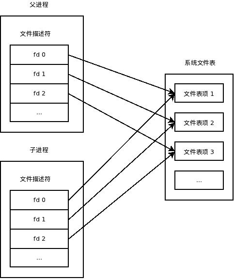

#使用FD_CLOEXEC实现close-on-exec，关闭子进程无用文件描述符
我们经常会碰到需要fork子进程的情况，而且子进程很可能会继续exec新的程序。这就不得不提到子进程中无用文件描述符的问题！

fork函数的使用本不是这里讨论的话题，但必须提一下的是：子进程以写时复制（COW，Copy-On-Write）方式获得父进程的数据空间、堆和栈副本，这其中也包括文件描述符。刚刚fork成功时，父子进程中相同的文件描述符指向系统文件表中的同一项（这也意味着他们共享同一文件偏移量）。                   


接着，一般我们会调用exec执行另一个程序，此时会用全新的程序替换子进程的正文，数据，堆和栈等。此时保存文件描述符的变量当然也不存在了，我们就无法关闭无用的文件描述符了。所以通常我们会fork子进程后在子进程中直接执行close关掉无用的文件描述符，然后再执行exec。

但是在复杂系统中，有时我们fork子进程时已经不知道打开了多少个文件描述符（包括socket句柄等），这此时进行逐一清理确实有很大难度。我们期望的是能在fork子进程前打开某个文件句柄时就指定好：“这个句柄我在fork子进程后执行exec时就关闭”。其实时有这样的方法的：即所谓的 close-on-exec。

close-on-exec的实现只需要调用系统的fcntl就能实现，很简单几句代码就能实现
```c
#include <unistd.h>
#include <fcntl.h>
#include <sys/types.h>
#include <sys/stat.h>
#include <stdio.h>
#include <stdlib.h>

int main(int argc, char *argv[])
{
	int fd;
	fd = open("conf", O_RDONLY);
	if (fd != -1);
		fcntl(fd, F_SETFD, FD_CLOEXEC);
	
	if (fork() == 0) {
		execlp("ps", "ps", "-ef", NULL);
	}
	return 0;
}
```
这样，当fork子进程后，仍然可以使用fd。但执行exec后系统就会字段关闭子进程中的fd了

one.c
```c
#include <unistd.h>
#include <stdio.h>

int main(int argc, char *argv[])
{
	execl("/bin/echo", "echo", argv[1], NULL);
	return 0;
}
```
the.c
```c
#include <unistd.h>
#include <fcntl.h>
#include <sys/types.h>
#include <sys/stat.h>
#include <stdio.h>
#include <stdlib.h>

int main(int argc, char *argv[])
{
	int fd;
	char x[10];
	fd = open("conf", O_RDONLY);
	if (fd != -1) {
		fcntl(fd, F_SETFD, FD_CLOEXEC);
		if (fork() == 0) {
			printf("开始执行\n");
			execl("./one", "one", fd, NULL);
		}
	} else {
		printf("没有找到指定文件\n");
		if (fork() == 0) {
			execl("./one", "one", fd, NULL);
		}
	}
}
```