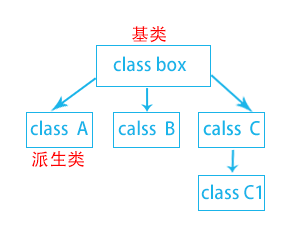

#基类、派生类

如上图，我们首先定义基类,我们可以看到，类box只有两个公开成员，height和width
```cpp
#pragma once
#include <windows.h>

class box
{
public :
	LPTSTR height;
	LPTSTR width;
};
```
再定义派生类          
派生类a,不仅继承了基类box的height,width成员，同时定义了自己的成员MAX        
派生类b,不仅继承了基类box的height,width成员，同时定义了自己的成员MIN        
派生类b,不仅继承了基类box的height,width成员，同时定义了自己的成员rect        
```cpp
#pragma once
#include "box.h"

class a : public box
{
public:
	LPTSTR MAX;
};
```
```cpp
#pragma once
#include "box.h"

class b : public box
{
public:
	LPTSTR MIN;
};
```
```cpp
#pragma once
#include "box.h"

class c : public box
{
public:
	LPTSTR rect;
};
```
派生类的派生类      
派生类c1,继承了父类的width,height,rect成员，同时定义了成员size
```cpp
#pramgma once
#include "c.h"

class c1 : public c
{
public:
	LPTSTR size;
};
```
在此，我们就明白了，基类只能使用自己定义的成员，派生类不仅可以使用自己定义的成员，还可以使用父类的成员        
